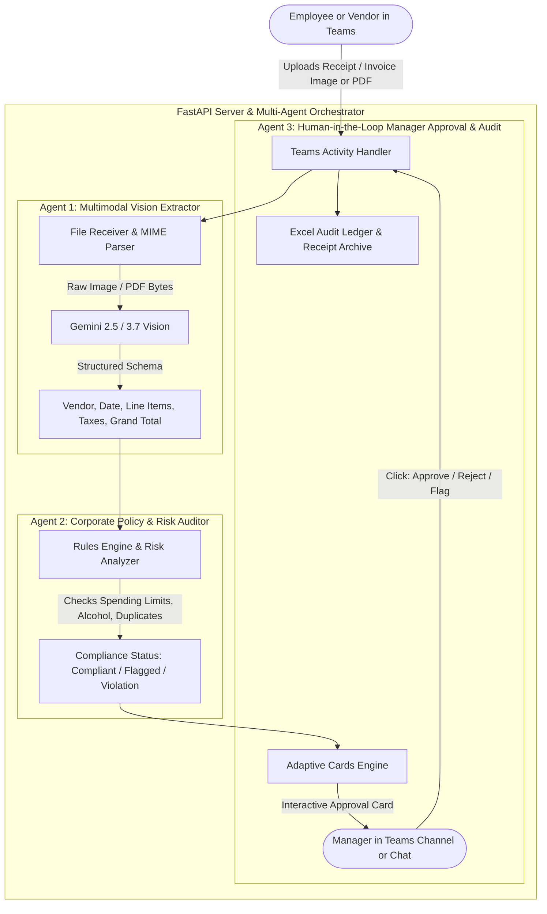

# Multi-Agent Invoice & Expense Auditor for Microsoft Teams

An enterprise-grade multimodal AI Agent integrated into Microsoft Teams that automates corporate expense reporting and vendor invoice auditing. Built with a **collaborative multi-agent architecture**, it extracts itemized data from receipt/invoice images and PDFs via **Gemini Multimodal Vision**, audits them against enterprise spending policies, delivers interactive **Human-in-the-Loop (HITL) Manager Approval Cards** in Teams, and logs approved transactions into an executive Excel audit ledger.

Powered by **Google Gemini 2.5/3.7**, **Microsoft Bot Framework**, **Pillow**, **OpenPyXL**, and **Pandas**.

---

## 🎬 Demo Video: Multi-Agent Invoice Audit & Manager Approval in Under 1 Minute

Watch the Multi-Agent Expense Auditor in action: an employee uploads a receipt image in Microsoft Teams, the Vision Agent parses itemized line items, the Policy Auditor flags restricted alcohol purchases, and the manager receives an interactive Adaptive Card to approve, reject, or request clarification—logging the transaction in the corporate audit ledger in under 60 seconds!

<!-- Demo Video / GIF Embed -->
[](https://github.com/luisteran5296/teams-expense-auditor-agent)


https://github.com/user-attachments/assets/afe8096b-92ad-4eee-8896-97883e131aa7


> [!TIP]
> **What this demo showcases:**
> 1. Dragging & dropping a receipt image or PDF directly into Teams chat.
> 2. **Agent 1 (Vision):** Zero-OCR structured extraction of merchant, date, tax, tip, and itemized lines.
> 3. **Agent 2 (Policy):** Automated risk scoring, meal limit enforcement ($75), and restricted item detection (alcohol).
> 4. **Agent 3 (HITL):** Interactive Manager Approval Card with `[✅ Approve]`, `[❌ Reject]`, and `[⚠️ Clarify]`.
> 5. **Audit Trail:** Automatic recording of approved transactions into an official Excel expense ledger (`.xlsx`).

---

## 🏛️ Multi-Agent Architecture



---

## 🤖 The Multi-Agent Pipeline

### 1. 👁️ Agent 1: Multimodal Vision Extractor (`src/agents/extractor.py`)
* Ingests receipt/invoice images (`.png`, `.jpg`, `.jpeg`, `.webp`) or documents (`.pdf`).
* Uses Gemini Multimodal Vision to extract:
  * **Merchant Details:** Name, address, contact, invoice/receipt number.
  * **Line Items:** Item descriptions, quantities, unit prices, line totals, and item categories.
  * **Financial Totals:** Subtotal, sales tax / VAT, tips/gratuities, and grand total.

### 2. ⚖️ Agent 2: Policy Compliance & Risk Auditor (`src/agents/auditor.py`)
* Evaluates extracted items against enterprise policy rules (`src/policies.json`):
  * **Meal Limits:** Flags single meals exceeding $75.00 per person.
  * **Restricted Purchases:** Specifically flags alcoholic beverages (beer, wine, cocktails, liquor) requiring VP authorization.
  * **High-Value Spending:** Flags purchases over $1,000 requiring prior Purchase Order (PO) numbers.
  * **Duplicate Detection:** Prevents duplicate reimbursement requests by tracking previous submission hashes.
* Computes an overall **Risk Score (0–100)** and categorizes status: `COMPLIANT` (🟢), `FLAGGED_WARNING` (🟡), or `POLICY_VIOLATION` (🔴).

### 3. ✍️ Agent 3: Human-in-the-Loop Manager Approval (`src/agents/approval.py`)
* Renders an **Interactive Adaptive Card** for the manager with:
  * Highlighted compliance badge and audit findings.
  * Itemized purchase breakdown with restricted lines flagged in red.
  * **Action Buttons:** `[✅ Approve Expense]`, `[❌ Reject Expense]`, `[⚠️ Request Clarification]`.
* **Audit Trail Ledger (`src/ledger/manager.py`):** Automatically appends approved records to `generated_ledgers/expense_audit_ledger.xlsx` with transaction IDs, manager timestamps, and financial sums.

---

## 📂 Project Structure

```text
teams-expense-auditor-agent/
├── .env.example
├── .gitignore
├── requirements.txt
├── README.md
├── test_agent.py                  # Standalone test suite with sample receipts
├── samples/                       # Test invoice images
│   ├── sample_compliant_software_invoice.png
│   └── sample_flagged_dining_receipt.png
├── appPackage/
│   ├── manifest.json              # Teams App Manifest (supportsFiles: true)
│   ├── color.png                  # 192x192 glowing icon (<30KB)
│   ├── outline.png                # 32x32 monochrome icon (<30KB)
│   └── teams-expense-auditor-agent.zip
└── src/
    ├── __init__.py
    ├── config.py                  # Settings & environment configuration
    ├── policies.json              # Configurable enterprise spending limits
    ├── app.py                     # FastAPI server hosting Teams webhook & /ledgers
    ├── agents/
    │   ├── __init__.py
    │   ├── extractor.py           # Agent 1: Multimodal Vision extraction
    │   ├── auditor.py             # Agent 2: Policy verification & compliance
    │   └── approval.py            # Agent 3: Manager action dispatch & ledger updater
    ├── ledger/
    │   ├── __init__.py
    │   └── manager.py             # Excel-based audit trail generator
    └── teams/
        ├── __init__.py
        ├── bot.py                 # Teams ActivityHandler (messages, file uploads, approval clicks)
        ├── cards.py               # Modern Adaptive Cards (Approval Card, Decision Receipts)
        ├── files.py               # Teams attachment downloader
        └── threading.py           # Thread-safe reply routing
```

---

## 🚀 Getting Started

### 1. Installation
```bash
# Clone the repository
git clone https://github.com/luisteran5296/teams-expense-auditor-agent.git
cd teams-expense-auditor-agent

# Create virtual environment
python -m venv .venv
# Windows
.\.venv\Scripts\activate
# Linux/macOS
source .venv/bin/activate

# Install dependencies
pip install -r requirements.txt
```

### 2. Environment Configuration
Copy `.env.example` to `.env` and fill in your keys:

```bash
cp .env.example .env
```

| Variable | Description | Example |
| :--- | :--- | :--- |
| `BOT_ID` | Azure Bot Microsoft App ID | `74fe027f-...` |
| `BOT_PASSWORD` | Azure Bot App Password / Secret | `...` |
| `BOT_TENANT_ID` | Azure AD Tenant ID | `...` |
| `PORT` | Local server port | `3978` |
| `PUBLIC_BASE_URL` | Public URL for file downloads (Dev Tunnel) | `https://your-tunnel.devtunnels.ms` |
| `GEMINI_API_KEY` | Google Gemini API Key | `AIzaSy...` |
| `GEMINI_MODEL` | Gemini model name | `gemini-3.7-flash` |

---

## 🧪 Testing the Agent Locally

Run the automated diagnostic test suite to verify Vision extraction, policy auditing, and Excel ledger generation:

```bash
python test_agent.py
```

### Test Suite Execution Summary:
* **Test 1:** Ingests `sample_compliant_software_invoice.png` ($240.00 SaaS). ➔ **Result:** `COMPLIANT` (🟢 0/100 Risk).
* **Test 2:** Ingests `sample_flagged_dining_receipt.png` ($201.60 with Cabernet Sauvignon Wine). ➔ **Result:** `POLICY_VIOLATION` (🔴 65/100 Risk, flags $75 meal limit & prohibited alcohol).
* **Test 3:** Simulates Human-in-the-Loop manager approval. ➔ **Result:** Records `EXP-202609-XYZ` in Excel ledger.
* **Test 4:** Reads `expense_audit_ledger.xlsx` and validates financial sums. ➔ **Result:** `PASSED`.

---

## 🌐 Running in Microsoft Teams

1. **Start the FastAPI server:**
   ```bash
   python src/app.py
   ```

2. **Expose port 3978 via Dev Tunnel:**
   ```bash
   devtunnel host -p 3978 --allow-anonymous
   ```

3. **Sideload to Teams:**
   Upload `appPackage/teams-expense-auditor-agent.zip` via **Microsoft Teams ➔ Apps ➔ Manage your apps ➔ Upload a custom app**.

4. **Try It Out:**
   * Drag and drop any receipt or invoice into the chat.
   * Review the extracted line items and compliance status.
   * Click **`[✅ Approve Expense]`** or **`[❌ Reject Expense]`** on the Adaptive Card.
   * Ask: *"Show current expense ledger"* to view total spend and download the Excel workbook.

---

## 📄 License
MIT License.
